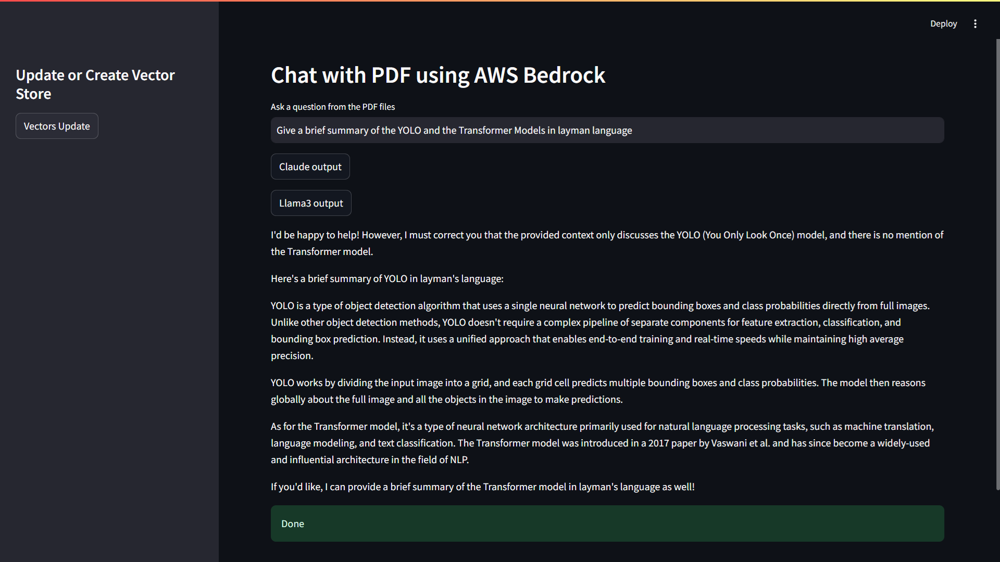

# Chat with PDF using AWS Bedrock

This project allows you to interact with PDF documents through a chat interface powered by AWS Bedrock models. The application ingests PDF data, generates vector embeddings, stores them in a vector database, and retrieves answers using LLMs like Claude and Llama3.



## Features
- Ingest and process PDF documents.
- Generate and store vector embeddings using Titan Embeddings.
- Query PDF content using state-of-the-art LLMs.
- Interactive chat interface using Streamlit.

---

## Installation and Setup

### 1. Clone the Repository
```bash
git clone <repository_url>
cd <repository_directory>
```

### 2. Create and Activate a Virtual Environment
```bash
python3 -m venv venv
source venv/bin/activate  # On Windows: venv\Scripts\activate
```

### 3. Install Dependencies
```bash
pip install -r requirements.txt
```

### 4. Set Up AWS Credentials
Ensure your AWS credentials are configured for the Bedrock service:
```bash
aws configure
```

### 5. Directory Structure
Place all your PDF files in a folder named `data` in the root directory:
```
project_directory/
│
├── data/               # PDF files go here
├── app.py              # Main application file
├── requirements.txt    # List of dependencies
└── README.md           # Project documentation
```

---

## Usage

### Run the Streamlit App
```bash
streamlit run app.py
```

### Sidebar Options
- **Vectors Update:** Process and store vectors from PDFs.
- **Claude Output / Llama3 Output:** Query the PDFs and get responses.

---

## Notes
- Ensure your AWS Bedrock account has access to the required models.
- Modify the `model_id` in the code if newer model versions are available.
- Make sure `boto3` is properly configured with appropriate permissions for the Bedrock service.

